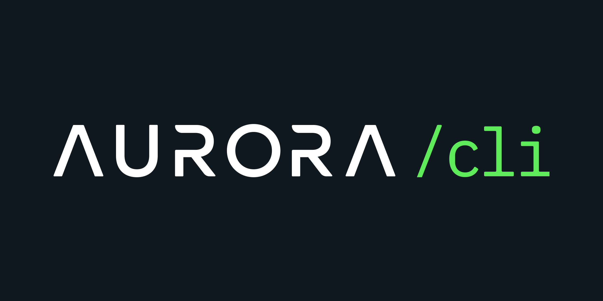

<br />
<p align="center">

</p>

<p align="center">
<strong>An instant, zero-config Aurora engine operator</strong>
</p>

<br />

[](https://github.com/aurora-is-near/aurora-cli-rs/actions/workflows/rust.yml)


## What is Engine?

[Aurora](https://doc.aurora.dev/getting-started/aurora-engine/) is an Ethereum Virtual Machine (EVM)
project built on the NEAR Protocol, that provides a solution for developers to deploy their apps
on an Ethereum-compatible, high-throughput, scalable and future-safe platform, with low transaction costs
for their users. Engine is the Aurora's implementation for it.

## What is Aurora CLI?
Aurora CLI is a command line interface to bootstrap Aurora Engine with rapid speed built with rust.

Aurora CLI comes pre-configuration with opinionated, sensible defaults for standard testing environments.
If other projects mention testing on Aurora, they are referring to the settings defined in this repo.

**Aurora CLI has the following advantages over api:**

- :pencil: **Easily modifiable EVM states through terminal**
- :handshake: **Quick to interact for rapid iterations**

See also prior version [aurora-cli](https://github.com/aurora-is-near/aurora-cli).

## Prerequisites
- :crab: Rust

## Quickstart

- 📦 Install `aurora-cli-rs` and start interacting with it: 
    *`cargo install --git https://github.com/aurora-is-near/aurora-cli-rs.git`* 
- 🔍 Check out what each command is for in the official Aurora [docs](https://doc.aurora.dev/tools/aurora-cli)
- ✋ Have questions? Ask them at the official Aurora [forum](https://forum.aurora.dev/)

## Example of usage

In the following example, we will see how to deploy Aurora EVM on the `localnet`. Also, we will deploy a simple EVM
smart contract and will be interacting with it.

#### What we need to have
- Rust 1.68.0 or newer
- Python3

First what we need to do is to install `aurora-cli`:

```shell
git clone https://github.com/aurora-engine/aurora-cli-rs
cd aurora-cli-rs && cargo install --path . 
```

Next we need to start a NEAR node locally. We can use the NEAR utility, `nearup`.

Install `nearup`:
```shell
pip3 install --user nearup
```

Start NEAR node:
```shell
nearup run localnet --home /tmp/localnet
```

After that we need to prepare an account and create a file with a private key for the Aurora EVM.

```shell
aurora-cli --near-key-path /tmp/localnet/node0/validator_key.json create-account \
  --account aurora.node0 --balance 100 > /tmp/localnet/aurora_key.json
```

Let's check if the account has been created successfully:
```shell
aurora-cli view-account aurora.node0
```

If everything went well, the response should be like this:
```json
{
  "amount": "100000000000000000000000000",
  "locked": "0",
  "code_hash": "11111111111111111111111111111111",
  "storage_usage": 182,
  "storage_paid_at": 0
}
```

Now we can deploy and initialize the Aurora EVM. To download the latest version, run the following command:
```shell
curl -sL https://github.com/aurora-is-near/aurora-engine/releases/download/latest/aurora-mainnet.wasm -o /tmp/aurora-mainnet.wasm
```

Deploy Aurora EVM:
```shell
aurora-cli --near-key-path /tmp/localnet/aurora_key.json deploy-aurora /tmp/aurora-mainnet.wasm
```

Initialize Aurora EVM:
```shell
aurora-cli --engine aurora.node0 --near-key-path /tmp/localnet/aurora_key.json init --chain-id 1313161556 --owner-id aurora.node0
```

And now we can deploy the EVM smart contract. In our example, it will be a simple counter that can return its current
value and increment and decrement its value.

But before that we need to generate a private key for signing transactions:
```shell
aurora-cli key-pair --random
```
The response should be similar to this:
```json
{
  "address": "0xa003a6e0e1a1dc40aa9e496c1c058b2667c409f5",
  "secret_key": "3fac6dca1c6fc056b971a4e9090afbbfbdf3bc443e9cda595facb653cb1c01e1"
}
```
**_NOTE:_** The key should be used for demonstration only. 

Deploy EVM smart contract:
```shell
aurora-cli --engine aurora.node0 --near-key-path /tmp/localnet/aurora_key.json deploy \
  --code $(cat docs/res/Counter.hex) \
  --abi-path docs/res/Counter.abi \
  --args '{"init_value":"5"}' \
  --aurora-secret-key 3fac6dca1c6fc056b971a4e9090afbbfbdf3bc443e9cda595facb653cb1c01e1
```
If everything went well, the response should be like this:
```
Contract has been deployed to address: 0x8417907c7158f02b42b0962cac27c4b4fd4a11f2 successfully
```
So. Now we have deployed the smart contract at address: `0x8417907c7158f02b42b0962cac27c4b4fd4a11f2`.

Let's interact with our smart contract. First, let's check that the current value is the same as we set in the
initialization stage. For that, we will use the `view-call` operation, which doesn't demand a private key
because it is a read-only operation:
```shell
aurora-cli --engine aurora.node0 view-call -a 0x8417907c7158f02b42b0962cac27c4b4fd4a11f2 -f value \
  --abi-path docs/res/Counter.abi
```
If we see `5` then everything is right.

Now let's try to increment the value:
```shell
aurora-cli --engine aurora.node0 --near-key-path /tmp/localnet/aurora_key.json call \
  --address 0x8417907c7158f02b42b0962cac27c4b4fd4a11f2 \
  -f increment \
  --abi-path docs/res/Counter.abi \
  --aurora-secret-key 3fac6dca1c6fc056b971a4e9090afbbfbdf3bc443e9cda595facb653cb1c01e1
```
In the response, we can see if the transaction was successful and the amount of gas used for the execution of this
transaction.

Let's make sure that our value was incremented:
```shell
aurora-cli --engine aurora.node0 view-call -a 0x8417907c7158f02b42b0962cac27c4b4fd4a11f2 -f value \
  --abi-path docs/res/Counter.abi
```
So, if we can see `6` in the output then the demo was successful. That's it!

Also, `aurora-cli` can be built with the advanced command line interface. Advanced CLI provides more options and
advanced features. You can try it by building with the following command:
```shell
cargo install --path . --no-default-features -F advanced
```
Documentation on how to work with the advanced version of `aurora-cli` can be found [here](docs/localnet.md).
